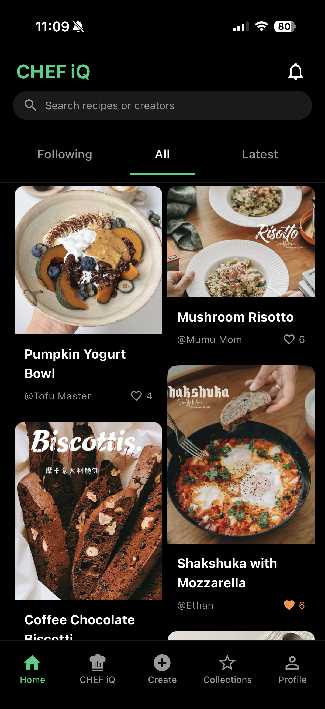
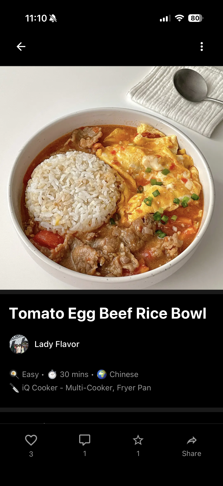
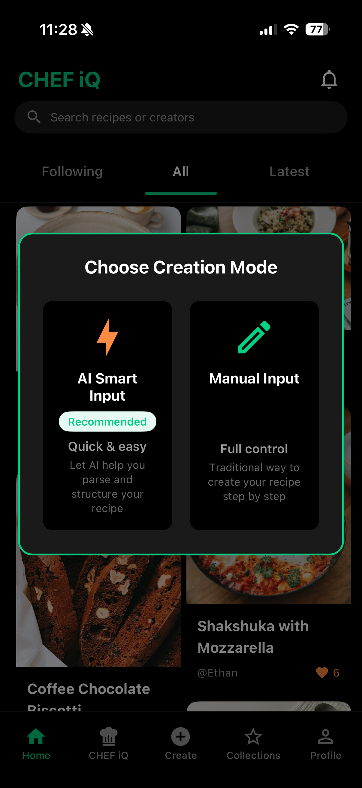
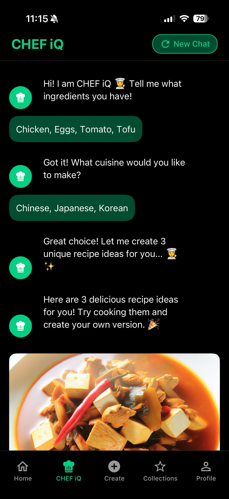
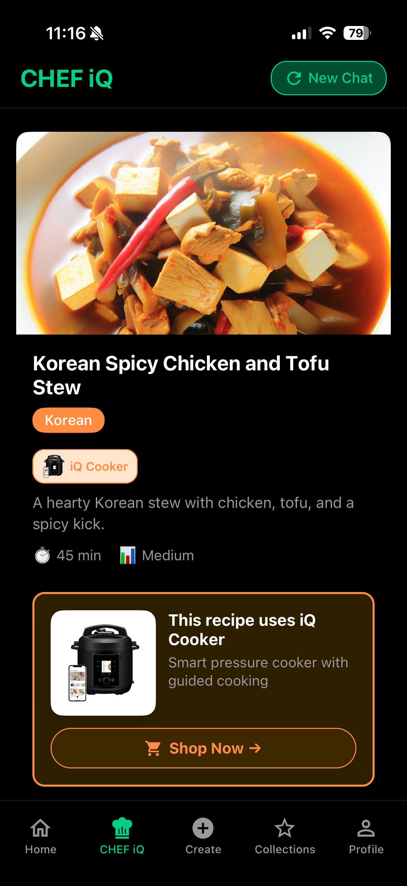
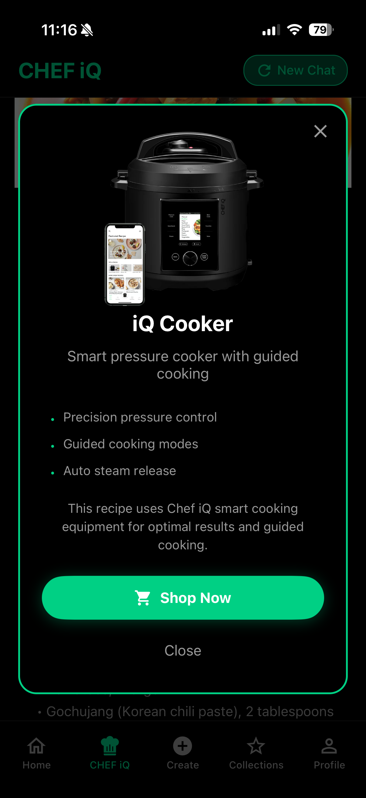
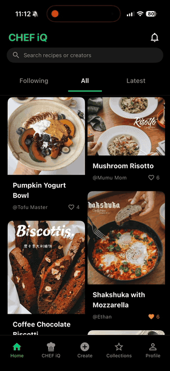
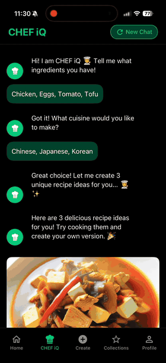

# ChefiQ Studio App

A mobile app for creating and sharing recipes, with AI help when you want it. Built with React Native and Firebase.

🌐 **[View Landing Page](https://ohohrain.github.io/CHEFIQ_STUDIO_APP_PUBLIC/)**

## What It Does

Create recipes, follow step-by-step cooking guides, like and comment on other people's recipes. You can type in ingredients you have and get recipe ideas from AI, or just create your own from scratch.

## 📱 App Preview

<div align="center">
  
  
  
</div>

<div align="center">
  
  
  
</div>

*Browse recipes, view details, get AI suggestions from ingredients, and discover smart cooking equipment.*

## 🎥 Demo

<div align="center">
  
  
</div>

*Quick walkthrough of the app's main features*

## Tech Stack

**Frontend:**
- **React Native + Expo** - Cross-platform mobile development framework for iOS and Android
- **React Navigation** - Stack and tab navigation with smooth transitions
- **React Native Paper** - Material Design components for polished UI
- **React Context API** - State management for auth, theme, likes, and more

**Backend:**
- **Firebase Authentication** - Email and Google sign-in with secure session management
- **Cloud Firestore** - NoSQL database for recipes, comments, likes, and user data
- **Firebase Storage** - Image hosting for recipe photos and user avatars
- **Cloud Functions** - Serverless functions for comment notifications and data processing

**AI Integration:**
- **OpenAI GPT** - Recipe generation from ingredients and cooking assistance
- **Custom prompts** - Optimized for recipe creation and culinary suggestions

**Developer Experience:**
- **Expo Go** - Instant preview on physical devices during development
- **Firebase Emulators** - Local testing environment for backend services
- **ESLint** - Code quality and consistency checks

## Getting Started

**You'll need:**
- Node.js (18 or 20)
- Expo Go app on your phone ([iOS](https://apps.apple.com/app/expo-go/id982107779) | [Android](https://play.google.com/store/apps/details?id=host.exp.exponent))

**Setup:**

```bash
git clone https://github.com/YOUR_USERNAME/chefiq-studio-app.git
cd chefiq-studio-app/studio_app
npm install
cd functions && npm install && cd ..
```

**Firebase Setup:**

1. Create a Firebase project at [console.firebase.google.com](https://console.firebase.google.com/)
2. Enable Auth (email + Google), Firestore, and Storage
3. Copy `.env.example` to `.env` and add your Firebase config
4. Deploy rules: `firebase deploy --only firestore:rules,storage:rules`

**Optional - AI Features:**
Get an OpenAI API key and add it to `.env` as `EXPO_PUBLIC_OPENAI_API_KEY`

**Run it:**

```bash
npm start
```

Open Expo Go on your phone, scan the QR code, and you're good to go.

## 🏗️ Project Structure

```
studio_app/
├── src/
│   ├── components/          # Reusable UI components
│   ├── screens/             # 16 screen components
│   │   ├── HomeScreen.js           # Feed with masonry layout
│   │   ├── CreateRecipeScreen.js   # Recipe creation
│   │   ├── RecipeDetailScreen.js   # Recipe viewing
│   │   ├── GuidedCookingScreen.js  # Cooking mode
│   │   ├── ProfileScreen.js        # User profiles
│   │   └── ...
│   ├── navigation/          # Navigation configuration
│   │   └── AppNavigator.js  # Stack + Bottom Tabs
│   ├── contexts/            # 7 React Context providers
│   │   ├── AuthContext.js
│   │   ├── ThemeContext.js
│   │   ├── LikeContext.js
│   │   └── ...
│   ├── services/            # Firebase & API integrations
│   │   ├── authService.js
│   │   ├── recipeService.js
│   │   ├── storageService.js
│   │   ├── aiService.js
│   │   └── ...
│   ├── config/              # Configuration files
│   │   └── firebase.js
│   ├── theme/               # Theme and colors
│   │   └── colors.js
│   └── utils/               # Utility functions
├── assets/                  # Images, fonts, icons
├── functions/               # Firebase Cloud Functions
│   ├── index.js
│   ├── commentFunctions.js
│   └── notifications.js
├── App.js                   # Root component
├── app.json                 # Expo configuration
├── firebase.json            # Firebase configuration
├── firestore.rules          # Firestore security rules
├── storage.rules            # Storage security rules
└── package.json             # Dependencies
```

## 🔧 Available Scripts

```bash
npm start           # Start Expo development server
npm run ios         # Run on iOS simulator
npm run android     # Run on Android emulator
npm run web         # Run in web browser
npm run lint        # Lint Firebase Functions (from functions/)
```

## 🔥 Firebase Configuration

### Firestore Collections

The app uses the following Firestore collections:

- `users` - User profiles and statistics
- `recipes` - Published recipes
- `recipe_drafts` - Unpublished recipe drafts
- `likes` - Recipe likes
- `collections` - User recipe collections
- `comments` - Recipe comments
- `comment_likes` - Comment likes
- `notifications` - User notifications
- `follows` - User follow relationships
- `recipe_views` - Recipe view tracking

### Security Rules

Security rules are defined in:
- `firestore.rules` - Database security rules
- `storage.rules` - Storage security rules

Deploy rules with:
```bash
firebase deploy --only firestore:rules,storage:rules
```

### Cloud Functions

Deploy Firebase Cloud Functions:
```bash
cd studio_app
firebase deploy --only functions
```

**⚠️ Important**: Always deploy specific functions by name to avoid overwriting:
```bash
firebase deploy --only functions:onCommentCreate,functions:onCommentDelete
```

## 🧪 Testing

### Testing on Device
1. Build the app using Expo Go (no compilation needed)
2. Test core features: auth, recipe creation, social interactions
3. Test AI features (requires OpenAI API key)

### Testing Locally
```bash
# Start Firebase emulators (optional)
firebase emulators:start

# Run the app
npm start
```

## 📄 Environment Variables

All required environment variables are listed in `.env.example`. Key variables:

**Required:**
- `EXPO_PUBLIC_FIREBASE_*` - All Firebase configuration values

**Optional:**
- `EXPO_PUBLIC_OPENAI_API_KEY` - For AI recipe generation features

## 🔒 Security Notes

- **Never commit `.env`** files (already in `.gitignore`)
- Each developer needs their own `.env` file
- For production, use Expo EAS Secrets or environment-specific configs
- Keep Firebase and OpenAI credentials private
- Review security rules before deploying to production

## 📚 Documentation

Additional documentation available in the repository:
- `studio_app/.env.example` - Environment variables reference
- `studio_app/firestore.rules` - Database security rules
- `studio_app/storage.rules` - Storage security rules

## 🙏 Acknowledgments

- Built with [Expo](https://expo.dev/)
- UI components from [React Native Paper](https://callstack.github.io/react-native-paper/)
- Backend powered by [Firebase](https://firebase.google.com/)
- AI features by [OpenAI](https://openai.com/)

---

**Questions or Issues?** Please open an issue on GitHub or contact the maintainers.

**Happy Cooking! 👨‍🍳🍳**
